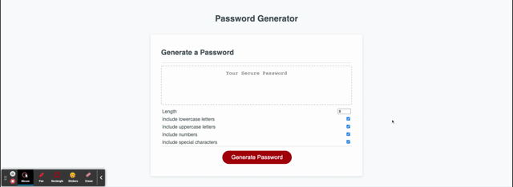

# PasswordGeneratorCustom

This application uses Javascript to generate a random, secure password for the user.

*How to?*
Enter the number of the characters in the Length field. The minimum is 8 and the maximum is 128.

Select options for your password: you can choose to include lowercase, uppercase letters, numbers, and/or special characters. Please note you **must** select at least one option.

Click the **Generate password** to generate the password.

[Deployed web page](https://vasylynash.github.io/PasswordGeneratorCustom/)

